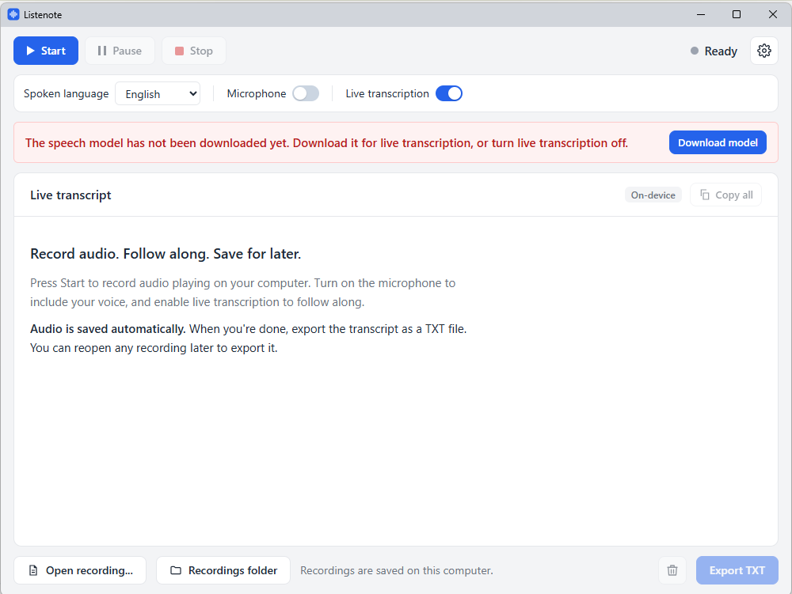
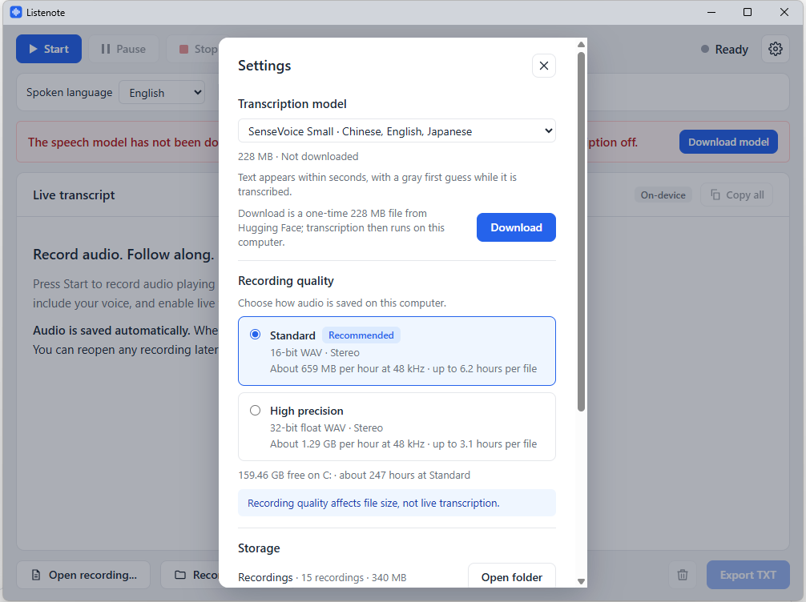

**English** | [简体中文](README.zh-CN.md)

# Listenote

Listenote is a lightweight Windows app that records audio and transcribes it live. It
records whatever plays on your computer, and can add your own voice from the microphone
at the same time.

Press Start and read the transcript as you listen. The recording and the text are saved on
your computer as you go, so you can read them again or export them as TXT at any time. At
Standard quality one recording can run for about 6 hours, so long lectures and meetings fit
in one go, and there is no limit on how many recordings you make.

Transcription runs entirely on your computer: no cloud AI, no account and no per-minute
fees, and nothing you record is uploaded. You only need the internet once, to download a
speech model; after that, recording and transcription work offline.

**[Download the latest version](../../releases/latest)**

## What you can use it for

- **Meetings**: see the text of online meetings and calls as they happen, and export it
  afterwards to write up notes. Turn on the microphone to include what you say.
- **Online classes and lectures**: follow along in text, and look back at anything you
  missed.
- **Learning a language**: read each sentence as you hear it in videos, podcasts and films
  in English, Japanese, Spanish and the other supported languages.
- **Practicing interviews and talks**: turn on the microphone, answer questions or give
  your talk out loud, then read back what you said.
- **Podcasts, blogs and videos**: play back your own episode or video, or speak your ideas
  into the microphone, and get a timestamped text draft for show notes, articles or
  subtitles.

## Features

- **Records system audio**: whatever plays through your speakers or headphones, with your
  microphone mixed in if you turn it on.
- **Live transcription on your device** with Alibaba's SenseVoice model for Chinese,
  English and Japanese, through sherpa-onnx, and OpenAI's Whisper speech models for the
  other languages, through whisper.cpp.
- **Eight spoken languages**: English, Chinese, Spanish, French, German, Japanese, Korean
  and Portuguese.
- **Saved as you record**: the audio and the transcript are written to disk continuously,
  so even if the app or the computer stops unexpectedly, the recording is kept up to the
  last few seconds.
- **Long recordings**: one recording can run for about 6 hours at Standard quality, or
  about 3 hours at High precision, and there is no limit on how many you make.
- **Export to TXT** with timestamps, and reopen any past recording later to read or
  export it again.
- **Interface in the same eight languages**, following your Windows display language
  unless you choose another in Settings.

## System requirements

- Windows 10 or Windows 11, 64-bit.
- A processor with AVX2 support, which most PCs from 2015 onward have. Some low-cost
  Celeron and Pentium processors lack it and cannot run transcription.
- Disk space for one or more speech models (141 MB to 465 MB) and for recordings, which
  take roughly 0.6 to 0.7 GB per hour at Standard quality.

## Getting started

1. [Download](../../releases/latest) the installer, and run it.
2. Because the installer is not code-signed, Windows may warn you twice:
   - Microsoft Edge may say the file "isn't commonly downloaded". In the downloads list,
     point to the file, click **...** (More actions), then **Keep**, then **Show more**,
     then **Keep anyway**.
   - When you run it, Windows may show "Windows protected your PC". Click **More info**,
     then **Run anyway**.
3. Open Listenote and choose the spoken language. The first time, a red notice says the
   speech model has not been downloaded yet. Click **Download model** in the notice, or the
   **Settings** button, the gear at the top right.

   

4. Under **Transcription model**, click **Download**. This happens once for each model;
   transcription then works offline.

   

   The speech model is safe to download:
   - It is a data file holding what the model has learned, not a program, and it cannot
     run by itself.
   - It comes from the public model pages on Hugging Face listed under
     [Speech models](#speech-models), or from the hf-mirror.com copy of them.
   - Listenote checks the file against its published SHA-256 hash and discards it if even
     one byte differs, so a damaged or altered file is never used.
   - It is saved only in the `Models` folder described under
     [Where your files are](#where-your-files-are), and can be deleted in Settings at any
     time.

5. Click **Start**. Turn on the microphone if you want your own voice included.
6. When you are done, click **Stop**, then **Export TXT** to save the transcript.

## Speech models

Models are downloaded from Hugging Face ([Whisper](https://huggingface.co/ggerganov/whisper.cpp),
[SenseVoice](https://huggingface.co/csukuangfj/sherpa-onnx-sense-voice-zh-en-ja-ko-yue-2024-07-17))
the first time you choose them, or from the [hf-mirror.com](https://hf-mirror.com) mirror if
Hugging Face cannot be reached, as is common in mainland China. They are checked against
their published SHA-256 hashes, and can be deleted again in Settings.

| Model | Size | How text appears | Suggested for |
|---|---|---|---|
| SenseVoice Small | 228 MB | Within a few seconds, with a gray first guess; Chinese, English and Japanese only | Chinese, English and Japanese |
| Whisper small | 465 MB | In passages, about every 30 seconds; more accurate | Korean, Spanish, French, German and Portuguese |
| Whisper base | 141 MB | Within a few seconds, with a gray first guess; less accurate | A smaller, faster choice for any language |

In testing, SenseVoice Small was about as accurate as Whisper small for English and more
accurate for Chinese and Japanese, while fast enough to show text within seconds. Like the
Whisper models, it often gets rare names and terms wrong.

Listenote remembers the model you choose for each spoken language.

## Where your files are

Everything is kept in the **Listenote** folder inside your **Documents** folder:

| Folder | Contents |
|---|---|
| `Recordings` | The audio of each recording (`.wav`) and its transcript (`.transcript.json`) |
| `Models` | Downloaded speech models |
| `Exports` | The suggested place for exported TXT files |

Uninstalling Listenote keeps this folder. Delete it yourself if you no longer need it.
Recordings deleted from inside the app go to the Recycle Bin.

## Privacy

Audio and transcripts never leave your computer. Listenote has no accounts and no
telemetry. The only time it connects to the internet is to download a speech model you
asked for.

## Good to know

- If the computer cannot transcribe as fast as the audio plays, Listenote skips some
  audio to stay current and marks the skipped parts in the transcript. A faster model
  avoids this.
- Each version can start new recordings until a date shown in Settings, about six months
  after it was built. After that, download the latest version; past recordings can still be
  opened and exported.
- Accuracy depends on the audio: clear speech with little background noise works best.
- Please make sure you are allowed to record what you record, and follow the consent and
  copyright rules that apply where you are.

## License

Listenote is free to use but is not open source; this repository only hosts its
installers. See [LICENSE](LICENSE) for the terms.

It is built on open-source software, including [whisper.cpp](https://github.com/ggerganov/whisper.cpp)
(MIT), [sherpa-onnx](https://github.com/k2-fsa/sherpa-onnx) (Apache 2.0),
[ONNX Runtime](https://github.com/microsoft/onnxruntime) (MIT), [Tauri](https://tauri.app)
(MIT or Apache 2.0) and [React](https://react.dev) (MIT). It uses OpenAI's
[Whisper](https://github.com/openai/whisper) models (MIT), and the
[SenseVoice Small](https://github.com/FunAudioLLM/SenseVoice) model by Alibaba Group's
FunAudioLLM team, under the
[FunASR Model Open Source License](https://github.com/modelscope/FunASR/blob/main/MODEL_LICENSE).
