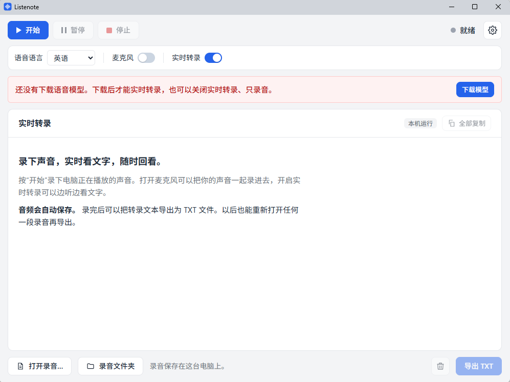
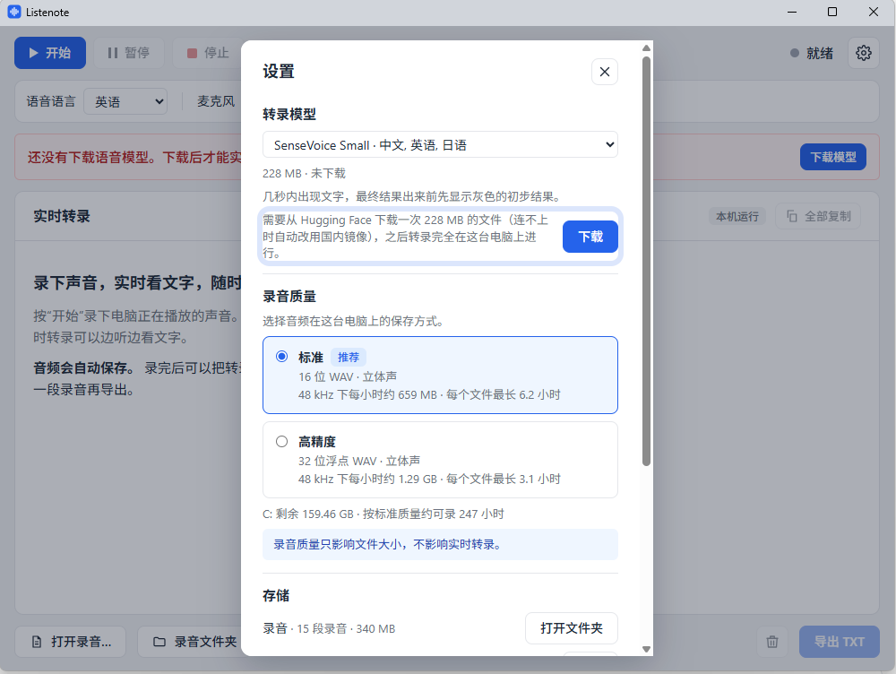

[English](README.md) | **简体中文**

# Listenote

Listenote 能录下 Windows 电脑上正在播放的声音，并在你听的同时实时显示转录文字。
网课、线上会议、播客、视频都可以：按"开始"，边听边看文字，录音和文字都会保存下来供以后回看。
语音在你自己的电脑上转录，录下的任何内容都不会上传。

**[下载最新版本](../../releases/latest)**

## 适用场景

- **开会**：线上会议、通话时实时看到文字，会后导出整理纪要。打开麦克风可以把你自己的发言也录进去。
- **上网课、听讲座**：边听边看文字，走神漏掉的地方可以回头再看。
- **学外语**：看英语、日语、西班牙语等语言的视频、播客、电影时，听到的每句话都能同步看到。
- **练习面试和演讲**：打开麦克风，对着问题大声回答或者把演讲讲一遍，结束后读读自己说了什么。
- **做播客、写博客、做视频**：播放自己的节目或视频，或者对着麦克风讲出想法，得到一份带时间戳的文字稿，用来写节目简介、文章或字幕。

## 功能

- **录制系统声音**：扬声器或耳机里播放的任何声音都能录下；打开麦克风，还能把你自己的声音一起录进去。
- **本机实时转录**：中文、英语、日语使用阿里巴巴的 SenseVoice 模型，通过 sherpa-onnx 运行；其他语言使用 OpenAI 的 Whisper 语音模型，通过 whisper.cpp 运行。
- **支持 8 种语音语言**：英语、中文、西班牙语、法语、德语、日语、韩语、葡萄牙语。
- **边录边保存**：音频和转录文本持续写入磁盘，即使应用或电脑意外停止，录音也会保留到停止前几秒。
- **导出 TXT**：带时间戳；以后随时可以重新打开任何一段录音，查看或再次导出。
- **界面同样支持这 8 种语言**：默认跟随 Windows 显示语言，也可以在设置里手动选择。

## 系统要求

- Windows 10 或 Windows 11，64 位。
- 处理器需要支持 AVX2，2015 年以后的电脑大多支持。少数低端 Celeron、Pentium 处理器不支持，无法使用转录。
- 磁盘空间：语音模型每个 141 MB 到 465 MB；录音按标准质量每小时约 0.6 到 0.7 GB。

## 开始使用

1. [下载](../../releases/latest)安装包并运行。
2. 因为安装包没有代码签名，Windows 可能会提示"Windows 已保护你的电脑"。点 **更多信息**，再点 **仍要运行**。
3. 打开 Listenote，选择语音语言。第一次使用时会出现一行红色提示，说还没有下载语音模型。点提示里的 **下载模型**，或者右上角齿轮形状的 **设置** 按钮。

   

4. 在 **转录模型** 下面点 **下载**。每个模型只需下载一次，之后转录完全离线。

   

   语音模型可以放心下载：
   - 它是一个数据文件，里面是模型学到的参数，不是程序，自己无法运行。
   - 它来自 Hugging Face 上公开的模型页面（见下面的[语音模型](#语音模型)），或者这些页面在 hf-mirror.com 上的镜像。
   - Listenote 会用官方公布的 SHA-256 校验文件，哪怕只差一个字节也会丢弃，所以损坏或被篡改的文件绝不会被使用。
   - 它只保存在[文件保存在哪里](#文件保存在哪里)里说的 `Models` 文件夹中，随时可以在设置里删除。

5. 点 **开始**。想把自己的声音也录进去，就打开麦克风。
6. 录完后点 **停止**，再点 **导出 TXT** 保存转录文本。

## 语音模型

模型在你第一次选用时从 Hugging Face 下载（[Whisper](https://huggingface.co/ggerganov/whisper.cpp)、[SenseVoice](https://huggingface.co/csukuangfj/sherpa-onnx-sense-voice-zh-en-ja-ko-yue-2024-07-17)）；连不上时（在中国大陆很常见）会自动改用国内镜像 [hf-mirror.com](https://hf-mirror.com)。
下载后会用官方公布的 SHA-256 校验，也可以在设置里删除。

| 模型 | 大小 | 文字出现方式 | 推荐用于 |
|---|---|---|---|
| SenseVoice Small | 228 MB | 几秒内出现，先显示灰色的初步结果；只支持中文、英语、日语 | 中文、英语、日语 |
| Whisper small | 465 MB | 按段落出现，大约每 30 秒一段；更准确 | 韩语、西班牙语、法语、德语、葡萄牙语 |
| Whisper base | 141 MB | 几秒内出现，先显示灰色的初步结果；准确率较低 | 任何语言下更小、更快的选择 |

测试中，SenseVoice Small 转录英语的准确率和 Whisper small 相当，中文和日语更准，而且速度快，几秒内就能出字。
和 Whisper 一样，冷门的人名、术语仍然常常会转错。

Listenote 会记住你为每种语音语言选择的模型。

## 文件保存在哪里

所有文件都在 **文档** 文件夹里的 **Listenote** 文件夹中：

| 文件夹 | 内容 |
|---|---|
| `Recordings` | 每段录音的音频（`.wav`）和转录文本（`.transcript.json`） |
| `Models` | 下载的语音模型 |
| `Exports` | 导出 TXT 时默认保存的位置 |

卸载 Listenote 不会删除这个文件夹，不再需要时请手动删除。在应用里删除的录音会进入回收站。

## 隐私

音频和转录文本永远不会离开你的电脑。Listenote 没有账号，也不收集任何使用数据。
只有在下载你选择的语音模型时才会联网。

## 注意事项

- 如果电脑转录的速度跟不上播放速度，Listenote 会跳过一部分音频以跟上进度，并在转录文本里标出跳过的部分。换用更快的模型可以避免这种情况。
- 每个版本在设置里显示的日期之前可以开始新录音，大约是打包后半年。过期后请下载最新版本；以前的录音仍然可以打开和导出。
- 准确率取决于音频质量：说话清晰、背景噪音少时效果最好。
- 请确认你有权录制所录的内容，并遵守当地关于录音许可和版权的规定。

## 许可证

Listenote 可以免费使用，但不是开源软件；这个仓库只用来发布安装包。具体条款见 [LICENSE](LICENSE)（英文）。

它基于开源软件构建，包括 [whisper.cpp](https://github.com/ggerganov/whisper.cpp)（MIT）、
[sherpa-onnx](https://github.com/k2-fsa/sherpa-onnx)（Apache 2.0）、[ONNX Runtime](https://github.com/microsoft/onnxruntime)（MIT）、
[Tauri](https://tauri.app)（MIT 或 Apache 2.0）和 [React](https://react.dev)（MIT）。
它使用 OpenAI 的 [Whisper](https://github.com/openai/whisper) 模型（MIT），以及阿里巴巴集团 FunAudioLLM 团队的
[SenseVoice Small](https://github.com/FunAudioLLM/SenseVoice) 模型，后者遵循
[FunASR 模型开源协议](https://github.com/modelscope/FunASR/blob/main/MODEL_LICENSE)。
